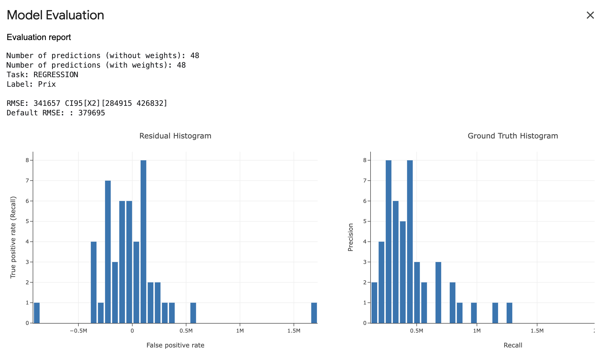
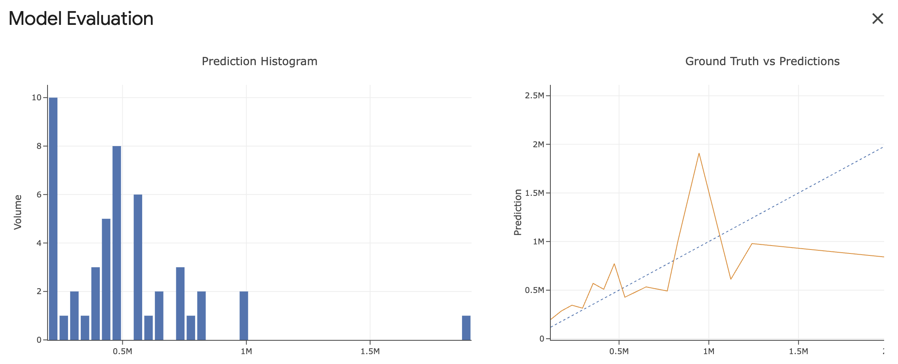
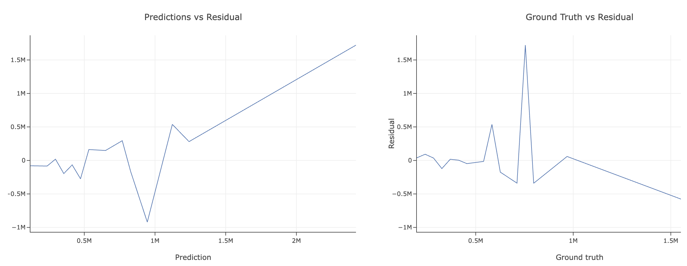

# Immobilier Price Detection

To estimate the price of an real estate property

----------------------------------------------------------------

## How use it

### To launch with Docker on Local

**! That's only work on linux/adm64 platforms !**

Because ydf package is not available on  arm64 and, that note compatible with arm64 compilation (to use it, read the next section below, to use it on gCloud run)

Build the image

```bash
docker build --platform linux/amd64 -t api:latest .
```

Launch the container

```bash
docker run -it --platform=linux/amd64 api 
```

### To test the API

You can access to the API docs from FastAPI on http://localhost:8080/docs

You can access the API documentation and try and better understand the data needed

### To Deploy the container on Google Cloud Run Service

Clone the repository

```bash
git clone https://github.com/Nic0ooo/PriceImmoPredictAPI.git
```

#### You need a Gcloud account

Deploy Docker container on Gloud run Service

```bash
gcloud run deploy api-model-predict-price --source ./api
```

Indicate the numeric choice for the Gcloud Server

To maintain the version and the configuration, you can configure Github CI/CD  on my Google Cloud Run to configure auto deploy on a branch of a Github Repo.

To more information check the official documentation of ydf about this [link](https://ydf.readthedocs.io/en/stable/tutorial/to_docker/#packaging-the-model-into-a-docker)

### To test the API

You can access to the API docs from FastAPI on url_gived_when_gcloudrun_deployement_is_ready/docs

You can access the API documentation and try and better understand the data needed

----------------------------------------------------------------

## How work this api

This api FASTAPI can be used to interact with a model of prediction

----------------------------------------------------------------

## How work this model

It's ydf model

With property details and location information, the model can predict price of a product

### Trainning of the model

Model trained with Simple ML for Sheets

On data web-scrapped on seloger.com during an professional formation with their consent for the recovery of this data using Instant Data Scrapper chrome extension

The model is trained using data of 1300 property send offer dataset (cleaned and prepared) from seloger.com

XLSX Dataset availbale on this repo, is /public/AnnoncesImmoDataSet.xlsx

### Model Evaluation on test data

#### MAE

Mean Absolute Error of the model is 45 804 € (average calculated on 30 test values)

The Mean percentage of the error compared to the expected price is 5 % of the expected price

This evaluation were calculated using 30 datas extract of the dataset before the model training to test and evaluate the model

#### Model Evaluation from Simple ML for sheets

Evaluation Repport



Prediction histogram



Predictions vs Residual


